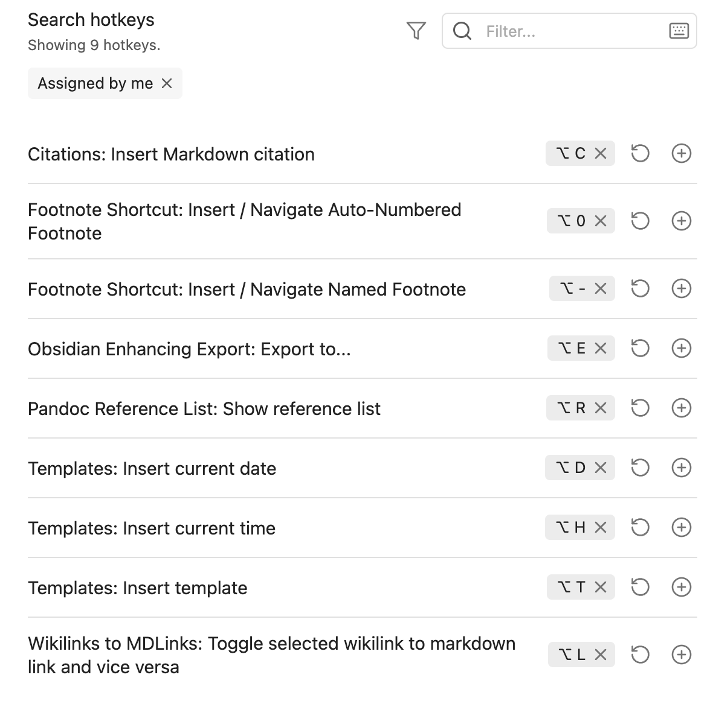

##  Obsidian Installed Plugins

*Updated on 2024-01-07*. Citations, Footnote Shortcut, Obsidian Enhancing Export, Pandoc Reference List and Wikilinks.

## Citations

Database path: `0_pandoc/My Library.json`

## Obsidian Enhancing Export

Default export folder: `/Users/myself/Documents/obsidian-zettelkasten/0_pandoc`

**Choose template**: html

**Arguments**: `-f markdown --resource-path="${currentDir}" --resource-path="${attachmentFolderPath}" --lua-filter="${luaDir}/math_block.lua" --embed-resources --standalone -s -o "${outputPath}" -t html`

**Extra Arguments**: `-c pandoc.css -A footer.html --bibliography refs.bib --citeproc --csl apa.csl`

## Pandoc Reference List

**Fallback path to Pandoc**: `/usr/local/bin/pandoc`

**Path to bib file:** `/Users/myself/Documents/obsidian-zettelkasten/pandoc/My Library.json`

**Libraries to include in bib:** `My Library`

**Citation style:** APA Ed 7.

## Hotkeys

